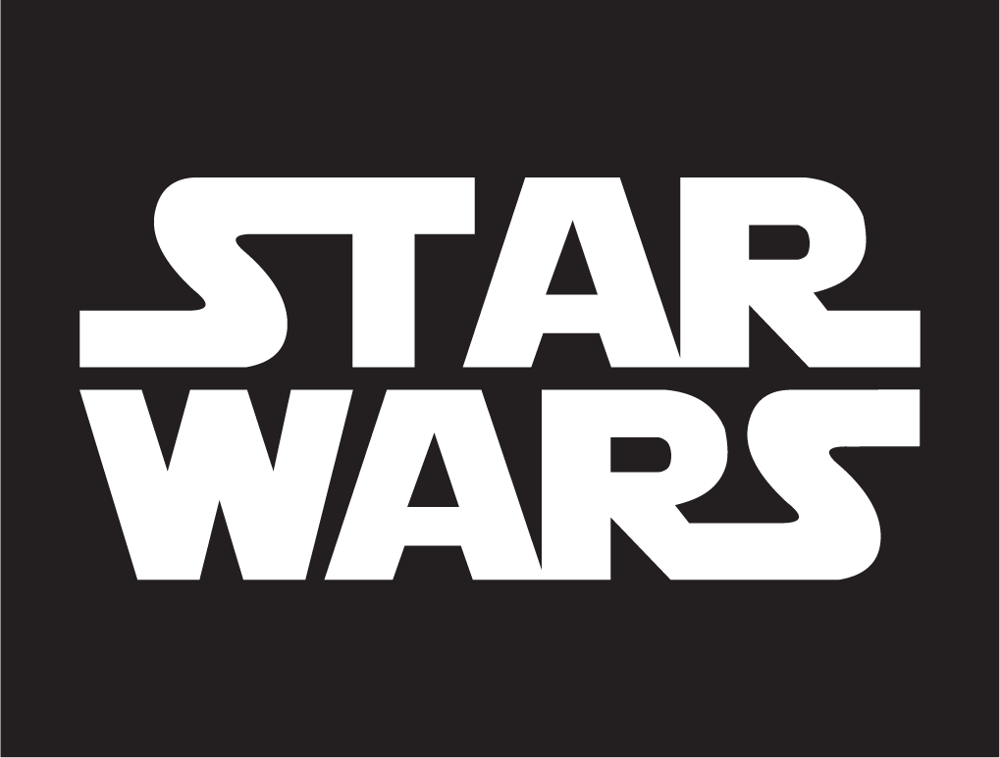
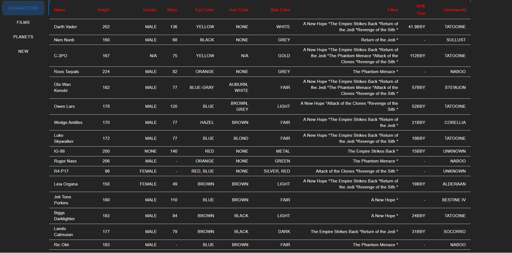
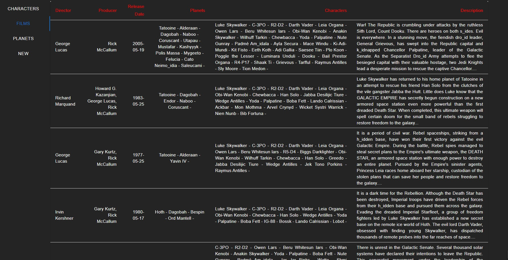
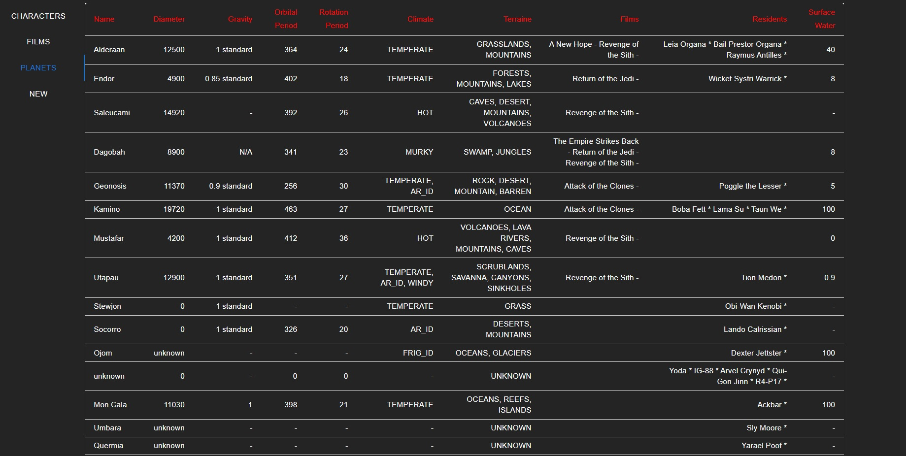
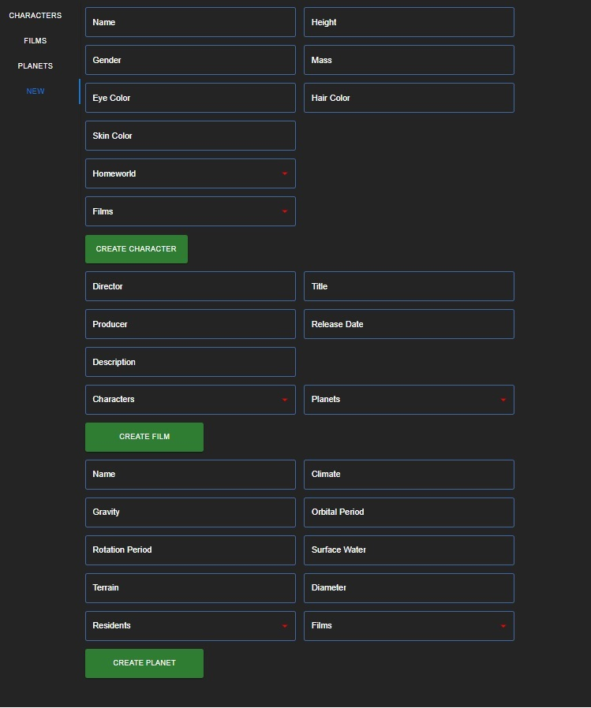

# Upskilling-Microservicios-BackEnd >> STAR WARS <<

  

Topic: Create a Microservice´s BackEnd deployed with Docker Compose (Google Cloud) 

#### Technologies:

- [ ] React - Vite
- [ ] NodeJs - Express
- [ ] MongoDB - Mongoose
- [ ] Docker Compose
- [ ] Gateway (http-proxy-middleware)
- [ ] Material UI

## Star Wars Characters:

  

## Star Wars Films:

  

## Star Wars Planets:

  

## Create New:

  

